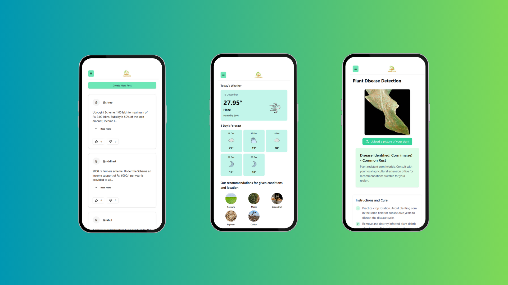

# 🌾 FarmEase

**FarmEase** is a full-stack web platform designed to empower farmers with tools, knowledge, and connections. From crop disease detection to accessing government schemes and connecting with suppliers, FarmEase is a digital ally for modern agriculture.

---

## 🚀 Features

- 🧠 AI-powered **crop disease detection**
- 🌦️ Real-time **climate and weather forecasts**
- 📦 Connect with **affordable seed suppliers**
- 📢 Live **farming news and government schemes**
- 🧑‍🌾 Guides for **skill development** and crop management

---

## 📸 Screenshots

---

## 🧰 Tech Stack

- **Frontend**: React.js
- **Backend**: Node.js / Express
- **Database**: MongoDB
- **ML Model**: TensorFlow / Keras (served via Flask API)
- **Weather Data**: OpenWeather API

---

## 🛠️ Getting Started

### Prerequisites

- Node.js (≥ 16)
- MongoDB
- Python 3.x (for ML model)
- OpenWeather API Key
- Render for deployment

### Original github link

[FarmEase](https://github.com/vinayrajaikar/FarmEase)
